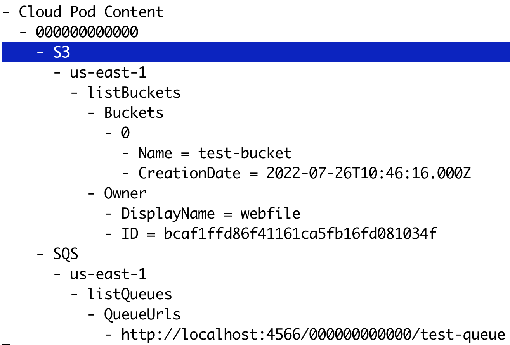
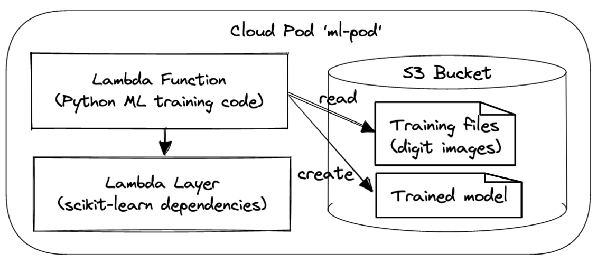




📢 Cloud Pods have seen a lot of improvements since this blog post was published. We have deprecated the `commit` and `inject` commands in favour of the new `save` and `load` commands. We have also made Cloud Pods available to our Community & Pro users. For more information, please refer to our [documentation](https://docs.localstack.cloud/user-guide/tools/cloud-pods/).

<br>

# Background: Ephemeral and persistent state in LocalStack

By default, the state of all services in LocalStack is ephemeral - i.e., whenever you restart the LocalStack Docker container, it presents a fresh instance with a clean state that can be used to create your application resources locally. This is the default mode, which is optimized for quick experimentation, and frequent container restarts, making sure to always start with a clean slate.

Our Pro version supports advanced persistence - a simple config flag `PERSISTENCE=1` can be used to enable the **persistence** of resources. The purpose of persistence is to ensure that the service state survives container restarts, in case you’re stopping and re-starting the LocalStack instance on the same machine.

Persistence is a great feature, as it allows our users to pause execution and then resume their work from the exact same application state. In some cases, however, you’d want to have more control over managing the state. This is where **Cloud Pods** come into play - cloud pods allow you to take a snapshot of the state at any point in time, and then selectively restore, merge, and inject it into your instance.

# Cloud Pods - persistent shareable state snapshots

Cloud pods are persistent state snapshots of your LocalStack instance that can easily be stored, versioned, shared, and restored. If you’re familiar with the `git` version control system, some of the concepts and commands of cloud pods will be familiar to you as well.

The figure below illustrates the main differences between persistence and Cloud Pods in LocalStack. Persistence ensures that any state changes happening within your instance are written to a persistent volume, such that the state gets restored when you restart your LocalStack instance next time.



With Cloud pods, on the other hand, we keep local storage for your state files that can be used to `commit` (take a snapshot of the running instance) and `inject` state (restore the snapshot into the running instance). In addition, we provide a secure remote Cloud Pods storage backend, that can be used to conveniently `push` and `pull` the state - making it extremely simple to share the state of your current instance with your team members.

## Cloud Pods 101

What does this mean in practice, how can we use Cloud Pods in the wild? Let’s consider the following simple use case.

Assume we’d like to make some changes to our LocalStack instance for project A, and then store the state, so that we can continue with some other work for project B, before coming back to continue working on project A later on.

First, let’s create some state in the local instance, and then we can `commit` (store) the state in a cloud pod named `p1`:

```bash
# create some resources in LocalStack (for project A)
$ awslocal s3 mb s3://test-bucket
$ awslocal sqs create-queue --queue-name test-queue
# commit the state to pod p1
$ localstack pod commit --name p1

# continue with work for project B ...
```

Later on - after restarting the LocalStack container with a fresh state, we can `inject` (restore) the previous state of the local instance to continue where we left off.

```bash
# restart LocalStack with a fresh state, then inject the state of cloud pod p1
$ localstack pod inject --name p1
```

For a full list of operations, please refer to our [documentation](https://docs.localstack.cloud/tools/cloud-pods/pods-cli/).

## Pod Inspect

After committing or pushing the state of a cloud pod, we can take a look at the high-level contents that are contained in it. Let’s use the `inspect` command from the terminal to display the contents of the pod `p1` that we just created before

```bash
$ localstack pod inspect --name p1
```

This will open an interactive shell that lists the resources contained in the cloud pod - in our case, the S3 bucket `test-bucket`, as well as the SQS queue `test-queue` (see screenshot below). If your terminal supports `curses`, you can interactively browse the tree and collapse/uncollapse its nodes.

<div style="text-align: center">
  
</div>

## Merge Scenarios

When working with application states, we need to consider different scenarios regarding how to combine cloud pod state with the existing state in the running LocalStack instance.

The simplest case is when we inject a cloud pod into a fresh LocalStack instance - however, how should we proceed if there are some resources already deployed in the current instance?

To cover the different scenarios, cloud pods support different merge strategies - the high-level approach is illustrated in the figure below.



* The first case, **inject with overwrite**, simply removes and overwrites any existing state in the instance. After injection, the instance state matches exactly the content of the cloud pod. This case is equivalent to restart LocalStack with a clean state and injecting a cloud pod and it is currently used as the default strategy.
* The second case, **inject with basic merge**, leaves the state of existing services untouched and adds the state of the pod into the instance. In the example, if we start from a state with SQS queue `q1` and inject an S3 bucket `b1`, the resulting instance state will contain the union of both `q1` and `b1`. In a nutshell, this case happens when there is no intersection of services between the local state and the one stored in the cloud pod.
* The third case, **inject with deep merge**, provides the ability to merge the state of resources with the same identity. In the example, we combine an S3 object `o1` with an object `o2` into a combined S3 bucket `b1`.

As you can imagine, the third merge scenario is the most complex one, and is also highly domain-specific for the respective services it gets applied to. As another example, assume we have a DynamoDB table `t1` in both, the running instance and the cloud pod - with the deep merge mechanism, we would end up creating a table that contains the table items from both the instance and the cloud pod.

Note that the merge strategies are currently still experimental and under active development. We'd love to get your feedback on which merge scenarios work best for your particular use cases!

# Cloud Pods Use Cases

Next, let’s highlight some of the exciting use cases that cloud pods are enabling - which allow us to fundamentally rethink how infrastructure state is managed, and how cloud apps are being developed collaboratively.

## Sharing state for collaborative debugging

Cloud Pods can be easily shared among team members and can be used to foster collaborative debugging. Let us consider the following simple use case. Bob is working on a new feature that uses three AWS services, namely SQS, Lambda, and Secrets Manager. He aims at implementing the following workflow: each time a message hits the SQS queue, a Lambda is automatically fired. The Lambda function checks for a secret stored in Secrets Manager and returns its details. Bob writes his Lambda handler and creates the necessary resources. Finally, he tries to send a message to the queue to test the end-to-end logic. Unfortunately, something seems odd: the Lambda returns a `404` error while attempting to fetch the secret.



After a couple of attempts, Bob asks for help from his co-worker Alice. Alice is very happy to do so. She asks him to push a Cloud Pod from his LocalStack instance that exposes the error. Bob pushes the pod and Alice pulls it onto the local machine. After digging a bit, Alice finds out that there is a region mismatch between the `boto3` client used in the Lambda function (`us-east-1`) and the other AWS resources previously created (`us-west-2`).

Alice goes ahead and fixes the Lambda code, and pushes a new version of the Cloud Pod. Bob can now pull the latest version and to try out the new code by sending a message to the queue. Bob is grateful to Alice, as he can now finally run his implementation locally end-to-end with no errors 🚀.
The picture above shows the end-to-end Cloud Pods's flow we just described.

## Pre-seeding CI environments

One of the most paramount use cases of LocalStack is its usage within various Continuous Integration/Continuous Delivery (CI/CD) environments. If you are running automated tests in CI, you might often feel the need to create test fixtures or additional resources to bootstrap your testing environment and test your application. Cloud Pods can facilitate and dramatically simplify this task.

Let us imagine the following example. _Pikachu GmbH_ uses an AWS ECS cluster to deploy its flagship software. They have a dedicated platform team that is responsible for managing the cluster and making it available to the development team. To facilitate the end-to-end testing, this team is also responsible for creating and maintaining a Cloud Pod that contains the state and configuration of the ECS cluster.



This pod is available in the cloud pod storage space at _Pikachu GmbH_ and can be easily pulled both, by each member of the organization, and from within the CI environment. This way, the Cloud Pod can be used in CI to bootstrap the testing environment where the application is then deployed and tested. Moreover, each individual developer can pull the same cloud pod and run some local tests. This approach provides a lot of flexibility to the team - indeed, every time some changes need to be done to the ECS cluster configuration, the platform team will simply push an update to the same cloud pod: the new version will then seamlessly be available for all clients at the next pull operation.

**Note:** In addition to preseeding a CI environment, cloud pods can also be used at the "other end" of a pipeline, namely to store and push the state of the LocalStack instance after a CI run has completed. This can be a game changer in debugging failing CI builds, by replicating the exact same state onto the local machine. There's a lot to unpack in this scenario, which goes a bit beyond the scope of this article - we'll cover this use case in a follow-up blog post in the near future!

## Creating reproducible application samples

Another prime use case for using cloud pods is to prepare reproducible application samples. For example, in the area of Machine Learning (ML), it is common practice to provide training data sets along with the code logic used to compute ML models, in order to make results easily reproducible.

Let’s assume we want to train an ML model that can recognize handwritten digits on an image. Cloud pods can help us create a reproducible sample - consider the simple application illustrated in the figure below: an S3 bucket contains the training data (image files with digits), a Lambda function defines the code for training the ML model, and a Lambda layer provides the dependencies of the ML library (e.g., `scikit-learn`).

<div style="text-align: center">
  
</div>

We can prepare this cloud pod, push it to the LocalStack platform, and then share it with our team - once available, it becomes as simple as running `localstack pod pull --name ml-pod` to replicate and run the app locally.

If you'd like to give it a try, the source code for the samples described above is available in this [Github repository](https://github.com/localstack/presentations/tree/main/2022-08-24-Pods-BlogPost).

# Brief Tech Deep Dive - How does it work under the covers?

Support for cloud pods has been a sizeable engineering effort at LocalStack, and we continue to fine-tune the implementation and user experience. We have introduced several abstractions that build the foundation for how cloud pods are working internally:

- **Cloud pods version store**: Each cloud pod has a set of metadata files associated which define the versions, revisions, commits, and state files that have been created for the cloud pod.
- **State merging**: Different mechanisms are being used to deal with diverging local and remote states when pulling cloud pods to the local machine. In the simplest case, we simply overwrite the local state with the content of the cloud pod. More advanced use cases involve merging of service states - using a generic mechanism for merging Python backend objects, as well as specialized mechanisms for merging service-specific persistence files (e.g., sqlite files).
- **Metamodel extraction**: In addition to storing the actual binary content to fully replicate a service state, we’re also extracting a metamodel of the cloud pod content, which represents a human-readable format that can be easily displayed via the CLI or in the Web user interface.
- **Secure storage**: When using the `push` operation, cloud pods are stored securely in our storage backend in AWS, with each user/organization receiving a dedicated, isolated S3 bucket. The `push` and `pull` operations are using secure S3 presigned URLs, in order for the pods CLI to interact directly with the S3 bucket, rather than piping the state files through our platform APIs. This improves performance and scalability of the remote cloud pods operations, and also helps decoupling for security reasons.

This is just a short peek under the covers - we'll share more implementation details in upcoming blogs and publications!

# Conclusions and Next Steps

We’re thrilled to get this next evolution of cloud pods to our users, which is available as part of our Team product tier as of now. If you’d like to give it a try, head over to [https://app.localstack.cloud](https://app.localstack.cloud) and sign up for the free trial!

We see cloud pods as a foundational technology that enables entirely new ways for how cloud applications are being developed - from managing and evolving application state, to preseeding CI test environments, to enabling collaborative debugging within your team.

In the future, we continue to explore use cases and usage patterns for cloud pods - we aim to evolve the different state merge strategies, establish auditability and governance rules for cloud pods, and provide tighter integration and analytics of cloud pods within your CI pipelines. We also envision a registry of cloud pods that will make it easy to provide pre-defined infrastructure components - complementing the popular mechanism of Infrastructure as Code (IaC) with the novel approach of Infrastructure as State (IaS) defined via cloud pods.

# Acknowledgments

Our kudos go out to Alireza Furutanpey for working on an initial version of the cloud pods versioning mechanism. Marco Palma has made invaluable contributions to the cloud pod merge algorithms and our overall testing strategy.
