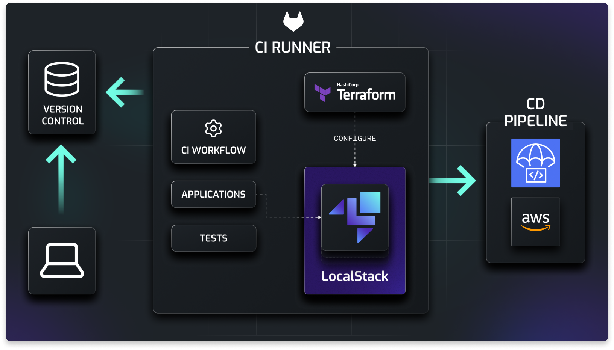
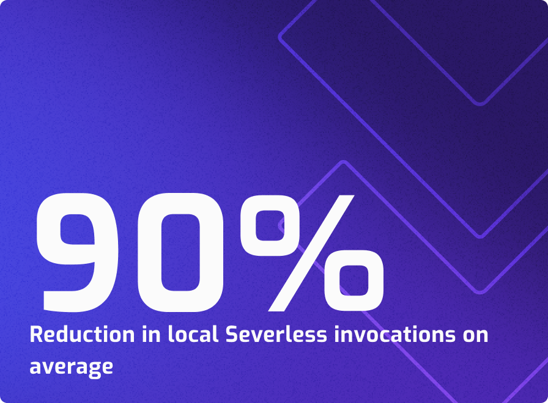
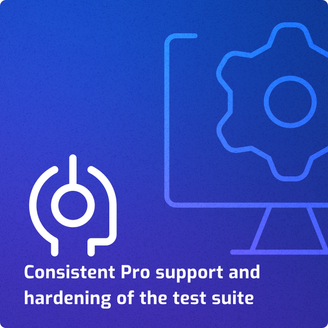


 

  > _“LocalStack has been a game changer in terms of development speed and efficiency for our team migrating our monolithic application to a serverless Node.js stack on AWS.”_
  

    
<a href="https://www.linkedin.com/in/kevinbreton/">Kevin Breton</a>,

    
VP of Engineering at <a href="https://www.knowbe4.com/">KnowBe4</a>

  

  
<a href="https://knowbe4.com/compliance-plus">KCM GRC Platform</a> by KnowBe4 is a governance, risk management, and compliance (GRC) software platform. Designed to help organizations move away from manual processes, KCM GRC efficiently manages risk and compliance by integrating with various third-party vendors. With KCM GRC, you can manage the complex area of compliance and audits, centralize policy distribution and tracking, and simplify the risk management process.

  
KCM GRC was developed earlier as a single-monolith using PHP and was using <a href="https://aws.amazon.com/fargate/">AWS Fargate Container Service</a> to host their monolith application. KnowBe4 started to re-engineer the application development using NodeJS and PostgreSQL while using various AWS services like <a href="https://aws.amazon.com/sns/">Simple Notification Service (SNS)</a>, <a href="https://aws.amazon.com/sqs/">Simple Queue Service (SQS)</a>, <a href="https://aws.amazon.com/s3/">S3</a>, <a href="https://aws.amazon.com/dynamodb/">DynamoDB</a>, <a href="https://aws.amazon.com/api-gateway/">API Gateway</a>, and <a href="https://www.terraform.io/">Terraform</a> as the Infrastructure-as-Code framework.

  
We spoke with Kevin Breton, VP of Engineering at KnowBe4, to learn more about how LocalStack has helped their engineers to improve their application migration and cloud adoption with LocalStack while empowering them with blazing-fast development and testing loops.

## Challenge

The initial challenge for the engineers at KnowBe4 was understanding the new AWS technologies and how to use them best. Previously, the software they were working on was a PHP-based monolithic application, where developers could not employ a testing & mocking framework judiciously. With the migration to a cloud-native approach, the engineers wanted to use AWS services best. 

To solve this problem, [Serverless Stack (SST)](https://sst.dev/), an open-source serverless application platform, was employed to help the engineers with an efficient development and testing loop. But soon, the wider use cases of the KnowBe4 team forced them to look at alternatives, and this is where Kevin got acquainted with [LocalStack](https://localstack.cloud)!

## Solution

The KnowBe4 team started using [LocalStack Pro](https://app.localstack.cloud/), which has more enhanced features and APIs over the [free, open-source community-focused solution](https://github.com/localstack/localstack). After initial usage, the KnowBe4 team started adopting LocalStack as a solution to spin up various AWS services inside a single-running Docker container. 

Engineers started using LocalStack with [Docker Desktop](https://www.docker.com/products/docker-desktop/) to build containerized applications and microservices. It led to an improvement in the development & testing lifecycles. The KnowBe4 team prefers to use our [`awslocal` command-line interface (CLI)](https://docs.localstack.cloud/user-guide/integrations/aws-cli/#localstack-aws-cli-awslocal) over Terraform.

  >_“While in the past we had to maintain our own tooling and local mocks, with LocalStack we can now empower our devs to iterate quickly without having to perform numerous code commits & waiting for AWS pipelines—hence also saving money on infrastructure!”_
  

    
<a href="https://www.linkedin.com/in/kevinbreton/">Kevin Breton</a>,

    
VP of Engineering at <a href="https://www.knowbe4.com/">KnowBe4</a>

  

Kevin engineered a serverless template that creates a custom serverless project with LocalStack and Terraform, including unit tests and all available integrations to simplify the project setup and development process. [Lerna](https://lerna.js.org/) is used to bootstrap everything together to create multiple Lambda functions at will. 

It allows the engineering team to develop and test their serverless functions with Lambda locally and push it to [GitLab CI](https://about.gitlab.com/features/continuous-integration/), the CI provider used by KnowBe4, where a staging environment is created using real AWS API calls. The simplification in the engineering process has been a benchmark for the KnowBe4 team as they continue relying on LocalStack for their local cloud development needs.

## Results

  
  

Within a few weeks, Kevin and his team members noticed the value LocalStack was bringing to their development and testing processes. LocalStack has simplified the creation and invocation process of AWS Lambda functions for KnowBe4 by nearly 90%. Previously, creating the Lambda functions on GitLab CI took around 7-10 minutes which is now created and tested locally in just a few seconds. It increases the reliability and efficiency of LocalStack as a credible local cloud development platform geared towards increasing developer productivity.

With LocalStack, the KnowBe4 team capitalized on our Pro support plan, which aims to support our Pro & Enterprise user base. KnowBe4 adopted the support plan to simplify its integration of local development cycles with LocalStack. With LocalStack support handled by our team, Kevin’s team was able to focus more on taking their application to cloud-native rather than taking time to learn LocalStack. It also prompted them to discover flaky tests easier and faster, giving them a clear view of how to debug them and make the best use of LocalStack.

Kevin is now introducing LocalStack to a new team which is core to all of KnowBe4's AWS initiatives. The project would utilize an event-driven architecture currently written in Python, Ruby, Golang, and Rust - and will leverage a diverse set of services, including AppSync, API Gateway, Lambda, SQS, S3, SNS, and EventBridge. With LocalStack, the team can develop & test their cloud infrastructure as the team decouples their existing code logic and adds new services. With this project, the KnowBe4 team could integrate all their products into a single platform.
