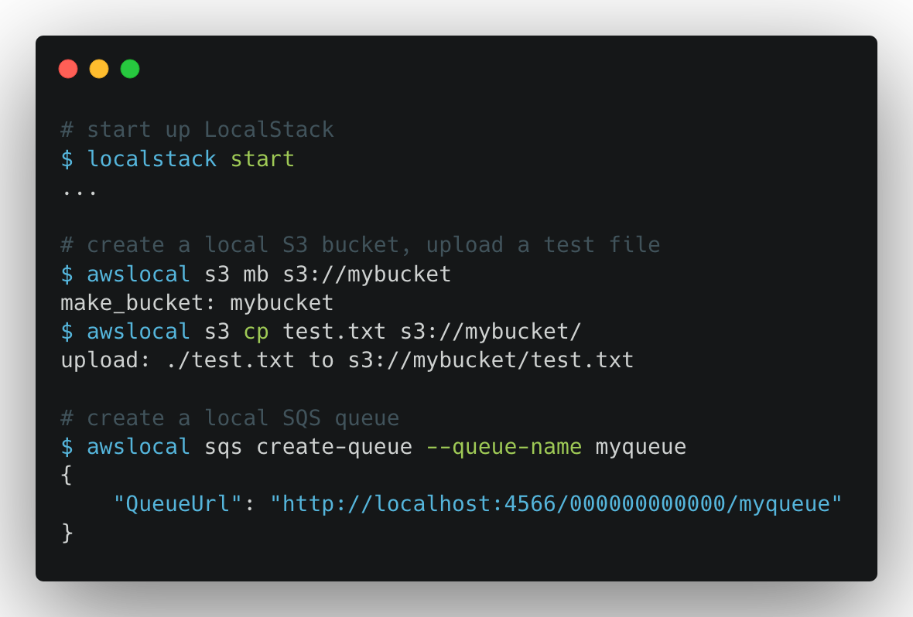
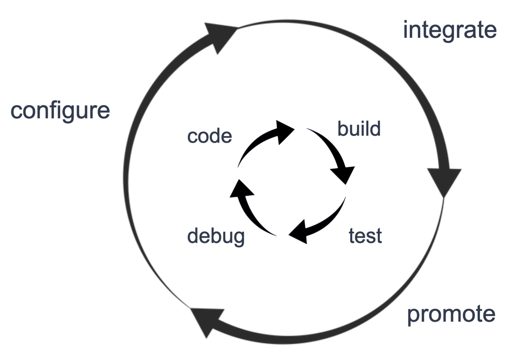

<section class="section section-md bg-light">
    

        

            

                <h1>LocalStack Cloud Emulation</h1>
                

                    LocalStack provides a fully functional local cloud stack - develop your cloud apps offline!
                

            

        

        

            

                <a href="https://docs.localstack.cloud/get-started" class="btn btn-outline-primary btn-lg mr-2">
                    Learn more
                </a>
                <a class="btn btn-primary btn-lg" href="https://app.localstack.cloud" class="btn btn-outline-primary btn-lg mr-2">
                    Get started now!
                </a>
            

        

    

</section>
<section class="section section-md section-alt">
    

        

            

                
            

            

                <h2 class="h1">Truly shift left - get productive with cloud dev from day 1</h2>
                <ul>
                    <li>Start up LocalStack as a Docker container - up and running in seconds</li>
                    <li>Provides the same APIs as the real cloud, all on your local machine</li>
                    <li>No need to write hand-crafted mocks for your unit and integration tests</li>
                    <li>Reduce the latency of your deploys - literally develop your apps offline</li>
                    <li>Remove the barrier for cloud dev - no more tedious cloud approvals!</li>
                </ul>
            

        

    

</section>
<section class="section section-md">
    

        

            

                <h2 class="h1">Turbocharge your inner dev loop - dev cycles in seconds</h2>
                <ul>
                    <li>Reduce deploy times from minutes to seconds</li>
                    <li>Instant feedback for any application changes - boosting your productivity</li>
                    <li>Avoid the slow and tedious deploy-test-redeploy cycles for your cloud apps</li>
                    <li>Hot deploy - instantly test changes in Lambda functions without redeploy</li>
                </ul>
            

            

                
            

        

    

</section>
<section class="section section-md section-alt">
    

        

            

                
            

            

                <h2 class="h1">Enhanced debuggability and full reproducibility across CI/CD</h2>
                <ul>
                    <li>Easily reproducible environments from local dev, across CI/CD, into prod</li>
                    <li>Set breakpoints in your local execution and hook into the in-memory state</li>
                    <li>Spin up ephemeral environments to test or showcase your changes</li>
                    <li>Directly reproduce red CI runs and build failures on your machine</li>
                </ul>
            

        

    

</section>
