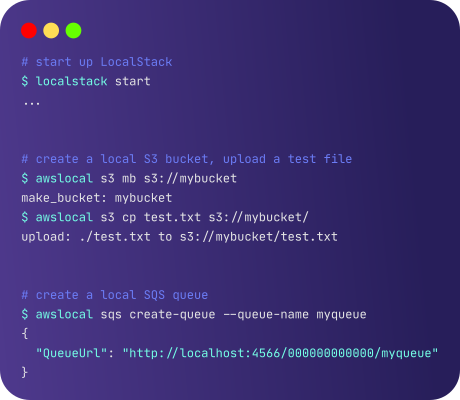

<section class="section section-sm bg-gradient-dark pb-10">
    

        

        

            

            
            

            

            

            

            

            

            

            
            

        

        

    

    

      

        <h1 class="text-center m-0 pt-5">Core Cloud Emulation</h1>
        

            LocalStack's cloud emulation technology provides a fully functional cloud stack on your local machine.
            Develop and test your cloud applications with the full cloud experience, but without the hassle of the remote cloud.
        

      

    

</section>
<section class="section pb-n8">
    

      

        

          <h2 style="letter-spacing: 0.05em">Benefits</h2>
        

      

      

        

            

                
            

            

                <h2>Your local cloud sandbox for development, testing, and experimentation</h2>
                <ul>
                    <li>More than 60+ emulated AWS cloud services, running entirely on your local machine</li>
                    <li>Provides the same APIs and services as the real cloud</li>
                    <li>No need to upload your code to the cloud for testing and debugging</li>
                    <li>Reduce the latency of your deploys - literally develop your apps offline</li>
                </ul>
            

        

        

            

                <h2>Truly shift left - get productive with cloud dev from day 1</h2>
                <ul>
                    <li>Start up LocalStack as a Docker container - up and running in seconds</li>
                    <li>Run your workloads and tests against the local API endpoints</li>
                    <li>No need to write hand-crafted mocks for your unit and integration tests</li>
                    <li>Remove the barrier for cloud dev - no more tedious cloud approvals!</li>
                </ul>
            

            

                
            

        

        

            

                
            

            

                <h2>Turbocharge your inner dev loop - dev cycles in seconds</h2>
                <ul>
                    <li>Reduce deploy times from minutes to seconds</li>
                    <li>Instant feedback for any application changes - boosting your productivity</li>
                    <li>Avoid the slow and tedious deploy-test-redeploy cycles for your cloud apps</li>
                    <li>Hot reloading - instantly test local changes in Lambda functions without redeploying</li>
                </ul>
            

        

        

            

                <h2>Use the Web user interface to browse and inspect resources locally</h2>
                <ul>
                    <li>Visual representation of the current state of your LocalStack instance</li>
                    <li>Similar to the AWS Web Console, but for browsing resources locally</li>
                    <li>Quickly access the key details of all services - S3 buckets, Lambda application logs, StepFunctions workflow executions, etc.</li>
                    <li>Drill into the state of your application and leverage the debugging capabilities directly in the Web UI</li>
                </ul>
            

            

                
            

        

      

    

</section>
<section class="section container">
  

    <h2 class="text-center">FAQ</h2>
  

    

        <h1 class="text-center">Any Questions?</h1>
        <a class="btn btn-primary btn-lg" style="width: 300px" href="/faq">CHECK OUT OUR FAQ</a>
    

</section>