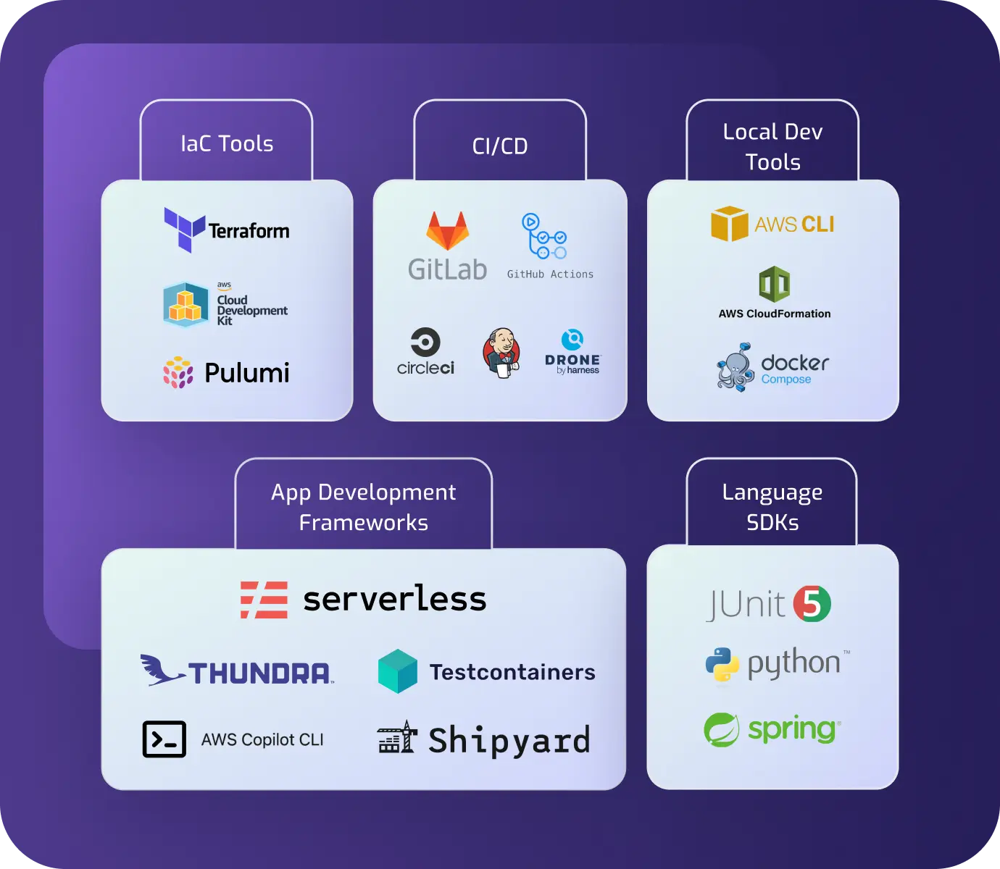
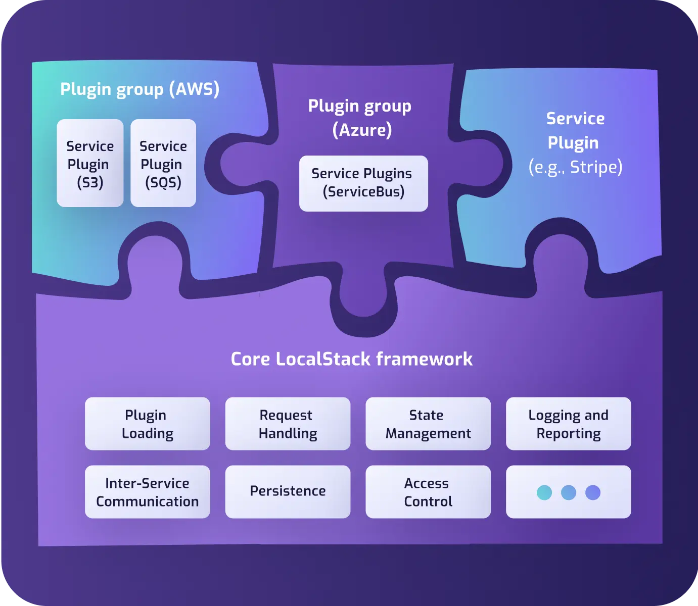

<section class="section section-sm bg-gradient-dark pb-10">
    

      

        

            

            
            

            

            

            

            

            

            

            
            

        

        

    

    

      

        <h1 class="text-center m-0 pt-5">Ecosystem</h1>
        

            The power of the cloud ecosystem, all in your local development platform with LocalStack.
        

      

    

</section>
<section class="section pb-n8">
    

      

          

            <h2 style="letter-spacing: 0.05em">Benefits</h2>
          

        

      

        

            

                
            

            

                <h2>Leverage our growing system of integrations</h2>
                <ul>
                    <li>Native integrations with key tools and platforms - from Infrastructure-as-Code frameworks to CI systems</li>
                    <li>We want to meet developers where they are - LocalStack fits seamlessly into your existing dev flow</li>
                    <li>LocalStack can integrate with virtually every cloud tool, as it provides emulation on the API level</li>
                    <li>A variety of tools, plugins, and CLI wrappers are provided to easily interact these integrations</li>
                </ul>
            

        

        

            

                <h2>Extensions architecture - opening up the LocalStack platform for third-party plugins</h2>
                <ul>
                  <li>Ability to plug in new emulators for third-party APIs (e.g., Stripe, Twitter, Dropbox, etc)</li>
                  <li>Develop your own services and advanced features, easily integrate them into the platform for local development</li>
                  <li>Leverage the common functionality provided by the framework - request handling, state management, plugin loading, and more</li>
                </ul>
            

            

                
            

        

        

    

</section>
<section class="section container">
  

    <h2 class="text-center">FAQ</h2>
  

    

        <h1 class="text-center">Any Questions?</h1>
        <a class="btn btn-primary btn-lg" style="width: 300px" href="/faq">CHECK OUT OUR FAQ</a>
    

</section>