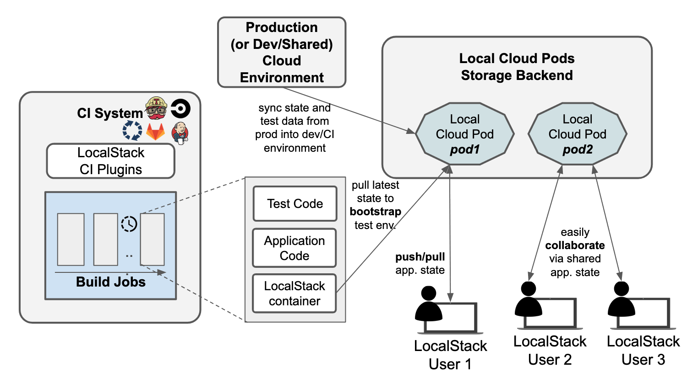

<section class="section section-sm bg-gradient-dark pb-8">
    

      

        <h1 class="text-center m-0 pt-5">Enterprise Integration</h1>
      

    

</section>
<section class="section section-sm pb-15">
    

        

            

                
            

            

                <h2>Detailed insights and traceability across the CI/CD pipeline</h2>
                <ul>
                    <li>Record all interactions happening throughout a CI build to get a detailed timeline of API calls and application states</li>
                    <li>Select and drill into the state at a particular point of execution</li>
                    <li>Correlate the timeline of API calls with state changes, to identify hot spots and defect root causes </li>
                </ul>
            

        

    

</section>
<section class="section section-sm bg-gradient-dark">
    

        

            

                
            

            

                <h2>Custom integrations to fit into the Enterprise IT landscape</h2>
                <ul>
                    <li>SSO integration with your preferred authentication provider</li>
                    <li>Offline version as well as self-hosting options of parts of the platform</li>
                    <li>Custom emulators for additional APIs to be plugged into the LocalStack platform</li>
                </ul>
            

        

    

    

        

            

                
            

            

                <h2>Dedicated technical support with SLAs</h2>
                <ul>
                    <li>Help with custom implementations</li>
                    <li>TODO...</li>
                </ul>
            

        

    

</section>

