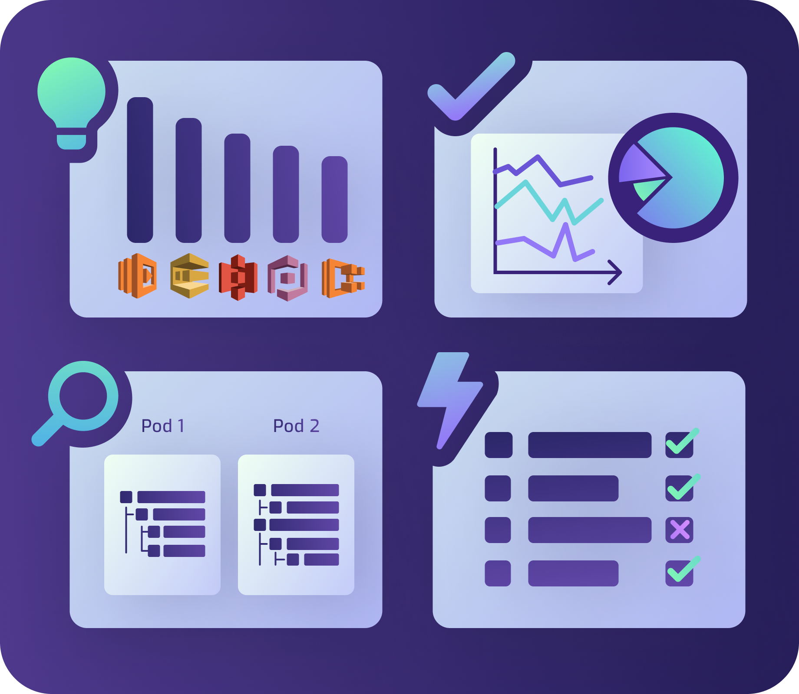

<section class="section section-sm bg-gradient-dark pb-10">
    

        

        

            

            
            

            

            

            

            

            

            

            
            

        

        

    

    

      

        <h1 class="text-center m-0 pt-5">Team Collaboration</h1>
        

            Resolve the friction and improve productivity of your cloud development teams with LocalStack's advanced collaboration features that natively scale with your workflow.
        

      

    

</section>
<section class="section pb-n8">
    

      

        

          <h2 style="letter-spacing: 0.05em">Benefits</h2>
        

      

      

        

            

                
            

            

                <h2>Local Cloud Pods - advanced persistence for sharing application state</h2>
                <ul>
                    <li>Store a persistent snapshot of your LocalStack instance </li>
                    <li>Inject cloud pods from your team members into your own local instance</li>
                    <li>Cloud Pods can be stored, shared, versioned - similar to git commits</li>
                    <li>Enable collaborative debugging - working on the same application state</li>
                </ul>
            

        

        

            

                <h2>Enhanced debuggability and full reproducibility across CI/CD</h2>
                <ul>
                    <li>Spin up LocalStack in your CI pipelines to run tests before pushing out changes to production </li>
                    <li>Fully reproducible environments from local dev, across CI/CD, into prod</li>
                    <li>Spin up ephemeral environments to test or showcase your changes</li>
                </ul>
            

            

                
            

        

        

            

                
            

            

                <h2>Tracing and analytics to gain deep insights into your application and the usage of LocalStack</h2>
                <ul>
                    <li>Drill-down of most commonly used services and API calls</li>
                    <li>Detailed audit log of interactions as well as API error codes in your app over time</li>
                    <li>Browse and investigate the state of your Cloud Pods and the contained resources, including version history</li>
                    <li>Investigate and correlate API call traces, to enable deep debugging within your team</li>
                </ul>
            

        

      

    

</section>
<section class="section container">
  

    <h2 class="text-center">FAQ</h2>
  

    

        <h1 class="text-center">Any Questions?</h1>
        <a class="btn btn-primary btn-lg" style="width: 300px" href="/faq">CHECK OUT OUR FAQ</a>
    

</section>